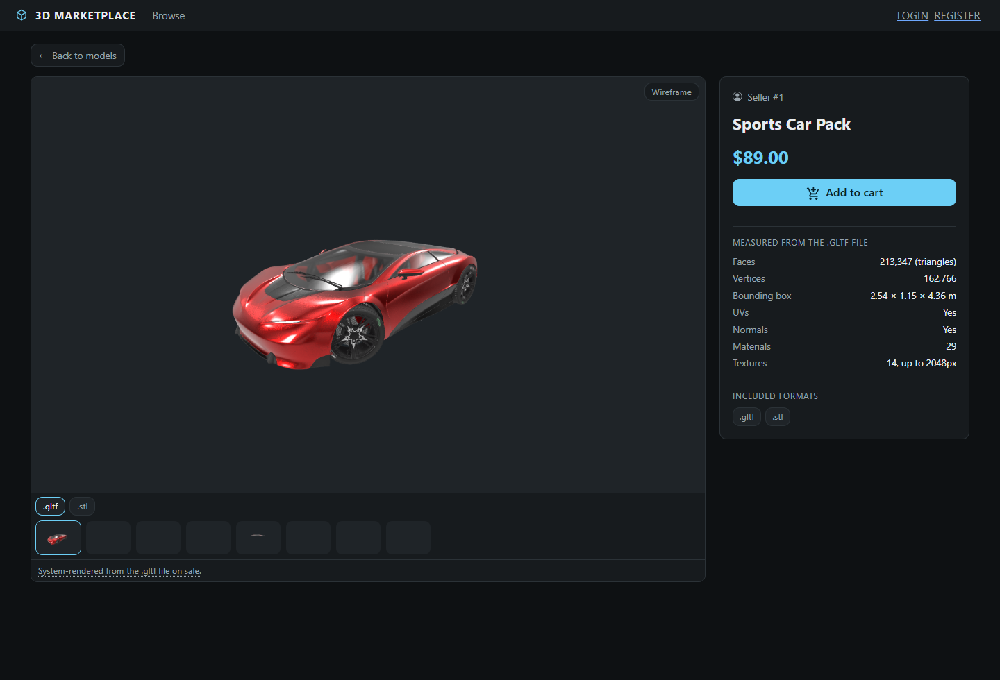

# 3D Marketplace

An app for 3D model trading with a simple concept: the buyer can request server rendered images of the model they are trying to buy, so the seller only gives away pixels and not the mesh until a purchase is complete.



## Workflow

### Framing the shots

A seller comes to the app with a bare model file or a zipped bundle (which includes the model and the textures) and sees an upload screen where their model is displayed in browser using three.js. In this stage, the app lets the seller pick out the camera angles for each of the formats they're selling. However, nothing about the picture is saved here, the system only writes down where the camera was standing (position, target, field of view), because the image itself gets drawn later, on the server.

Here the app gives the seller the option to "decimate" the model, a cut-down copy of the mesh at a ratio they pick, or just a bounding box if they'd rather give away nothing at all. That's what a buyer gets to spin around later, so the real geometry never has to leave.

The seller frames the shot in a browser, but the server draws it minutes later in a container, possibly on a different machine, and those two have to agree or the seller would compose one picture and the listing would show another. So the render container is built with the same three.js version and the literal same framing code. `fitToView.js`, `simplify.js` and `shrinkTextures.js` are copied into the image straight out of the client source. Since this is the kind of thing that breaks quietly, a test fails the build if one of those files gets copied into the image without also being added to the list that tells CI to rebuild it.

### Rendering

The seller can then click upload when they're satisfied with their shots. The app checks and measures the file before storing any of it, and hands back a response straight away. A render takes minutes, which is far too long to hold a request open, so the real work goes onto a Redis queue and a worker picks it up from there. Each format gets rendered twice, once shaded and once as a wireframe, and a lock stops the same file being rendered twice over if the job retries. The seller doesn't have to sit there refreshing either. Progress is pushed to their browser over a websocket, so the images show up as they land. Publishing the listing is a separate step, and the app refuses it while there's still no picture to show.

The worker that picks up that job is opening a file uploaded by someone nobody has ever met and it drives a browser engine over it. That is the most likely thing in this system to be exploited, so it happens inside a container with no network, every Linux capability dropped, a read-only root filesystem, capped memory and CPU, and one scratch mount that nothing can be executed from.

Docker is what does the locking down, and that brings a problem of its own. Anything that wants to start a container has to talk to the Docker daemon, and whatever can talk to it can start any container it likes, including one that mounts the entire host machine. Having that permission is the same as being root on the server. The worker that sits there unpacking zip files from strangers is not the thing that should have it, so it doesn't.

Instead the worker writes down what it wants done and leaves that note on a Redis list: which kind of job, and which folder the file is sitting in. A second process called the broker is the only one allowed to talk to Docker. It reads the note and builds the docker command itself, out of a list of job types written into the code. The image, the entry point, the arguments, the mounts and the flags all come from that list. So even if someone took over the worker completely, the most they could ask for is a render of a folder they already control.

This section is guarded by tests that try exactly that, they send notes asking for privileged mode, for host networking, for a different image, for the host filesystem mounted inside the container, and check that every one of them is treated as plain text rather than carried out.

The container itself runs a headless Chromium that draws using SwiftShader, which rasterises on the CPU instead of a graphics card. Doing it in software is slower, but it is repeatable, allowing the same model, the same camera and the same renderer to produce exactly the same pixels every time.

### Checking the pictures

Since the renderer is repeatable, a picture can be checked rather than taken on faith. Every image the app stores comes with a record of how it was made, covering the hash of the model file it was drawn from, the camera that was pointed at it, and which renderer did the drawing, down to the digest of the container image. The digest is used instead of a tag because a tag like `latest` can be rebuilt to mean something different tomorrow, while a digest cannot.

That record is public, so anyone looking at a listing can pull it up from `GET /api/previews/{id}/attestation`.

The `still_on_sale` field does the work. It compares the model the picture came from against the files currently attached to the listing, so a seller who swaps the model after the photos were taken gets caught without anything needing to be re-rendered.

The response carries its own caveat too, in that `reproduce.limit` field. All of this is the server restating its own record, and nothing is signed, so it shows the app is internally consistent rather than proving the app is honest.

Anyone who wants to go further than reading the record can run the whole thing again. `render:verify` pulls the current model, draws every angle from scratch and compares the results hash by hash against what the listing is showing.

```
$ php artisan render:verify 47
.gltf: fetched 28829580 bytes from the models disk.
+--------+-------+-----------+-------------------+-------------------+-------+
| format | angle | pass      | attested          | re-rendered       |       |
+--------+-------+-----------+-------------------+-------------------+-------+
| .gltf  | 0     | shaded    | 120a8e2f65916ff4… | 120a8e2f65916ff4… | match |
| .gltf  | 0     | wireframe | 4e33f286d536f87d… | 4e33f286d536f87d… | match |
| .gltf  | 1     | shaded    | d94dda69803ca060… | d94dda69803ca060… | match |
+--------+-------+-----------+-------------------+-------------------+-------+
.gltf: same renderer build as the attestation (def5ec5af962…).
Every attested image reproduces byte-for-byte from the current model.
```

That also covers the less obvious case, where someone swaps the model and rewrites its recorded checksum to match, which gets past the simple comparison because the file now agrees with its own record. The pictures still catch it, since they remember which model they were drawn from, and there is a test that does exactly this.

CI runs the same check whenever the renderer changes, against a model committed to the repo along with the image hashes it is expected to produce. It last reproduced them byte for byte on GitHub's hardware, which is not the machine those hashes were recorded on.

### Hostile uploads

Three of the obvious ways to handle an uploaded model are exploitable, which is why the file gets checked before any of it is stored.

A glTF file is a tree of nodes, and the natural way to read one is to walk into each node's children. A 360 byte file that lists itself as its own child will exhaust a 64MB PHP process in under a second, and since this runs inside the web request, sending it a few times takes down every worker. The reader keeps a set of the nodes it has already visited, plus a depth limit.

Images are worse, since `getimagesizefromstring` reports the dimensions a file claims rather than the ones it has. A few kilobytes claiming 30,000 by 30,000 pixels asks for gigabytes the moment anything tries to decode it, so the dimensions get checked before any decoding happens.

Archives have to be accepted, because that is how a model arrives with its textures beside it. The index gets read first and nothing is written until it passes checks on entry count, declared size, compression ratio, path traversal, path length, Windows reserved names and case collisions. `ZipArchive::extractTo` goes unused on purpose, since it flattens entry paths which breaks the sibling references the archive exists for, it stops halfway through on a bad entry, and it will quietly drop a file that collides with another by case while still reporting success.

### What the listing says about a model

Nothing in the specifications panel was typed by the seller. Face and vertex counts, the bounding box, whether UVs and normals are present, material counts and real texture dimensions are all read out of the uploaded file. Memory does not grow with the model either, since an `.obj` is counted in a single streaming pass and a glTF is read from its header plus byte ranges pulled on demand, so a 600MB model costs about what a small one costs.

Rigged models get their own set of numbers. The app reads how many bones there are and how many of them actually do any work, whether any part of the mesh is attached to nothing, what the animations are called, and which toolchain the rig came out of, guessed from the bone naming conventions.

### What the buyer gets

A buyer looking at a listing sees the rendered stills, the wireframe pass beside them, and the specifications panel. There is no route anywhere on the public side that hands over the model itself, and there is a test whose only job is to walk the routes and assert that.

If the seller turned the interactive viewer on, the buyer can spin the decimated copy around. The app measures that copy after it has been built and refuses to publish it if it did not actually come out smaller than the original, since a simplifier that handed the model back untouched would have put the full mesh on a public route.

A buyer who wants an angle nobody framed can ask for one, and the server renders it and sends back another picture. That is bounded both by how many a single person can request in a day and by how much processor time they can spend, because a count on its own is not a budget when one request takes a few seconds and the next one takes a minute and a half.

### Payment

Checkout opens an order and hands off to PayPal, and the app only acts on what comes back through the webhook once it has verified the signature. Providers redeliver, so every event is recorded and a second copy of the same one does not grant a second sale. A refund takes the download back, and a paid notification that turns up after a refund does not hand it over again.

Webhooks also go missing, which is the worse case, since that is a customer who paid and got nothing. A reconcile command goes through orders still sitting pending, asks the provider what actually happened to them, and settles them.

The download itself is a signed link behind a purchase check, and anything else gets a 403. Whoever is allowed to download the current file can also fetch the versions it replaced, so a seller updating their model does not take away what somebody already bought.

## Running the project

```
cp 3d-shop-api/.env.example 3d-shop-api/.env
docker compose up --build
```

The client comes up on `http://localhost:3000` and the API on `http://localhost:8000`. Compose starts Postgres, Redis, MinIO standing in for S3, the API, a queue worker, the container broker, Reverb for the websockets, and the client. The render image is built first, since the worker cannot do anything without it. There is no hosted demo, the stack is meant to be run locally.

The test suites and the static analysis run separately:

```
cd 3d-shop-api    && php artisan test
cd 3d-shop-client && npm test

composer stan            # PHPStan at level 5, through Larastan
vendor/bin/pint --test   # formatting
```

The API suite needs Postgres and Redis up. Tests that need a container skip themselves when Redis is not there rather than failing.

CI runs the same checks, and rebuilds the render image only when a file it is built from has changed. When it does rebuild, the image has to reproduce the committed fixture before anything gets published.

## Known limitations

Nothing in the attestation is signed. Closing that gap properly would mean signing each record and publishing a running digest of them somewhere append-only, which is a known approach and would sit on top of this without changing any of it.

Payments run against PayPal's sandbox. Signatures are verified and orders are reconciled against the provider, but no real money moves.

The render quotas are set for a demonstration rather than a business. A buyer can ask for far more renders in a day than anything real would allow, because a realistic ceiling would stop anyone from trying the feature at all.

Reproducibility has been shown on two machines rather than on all of them. SwiftShader compiles itself for the processor it finds, so identical output across different hardware is something the CI run demonstrates for one fixture, not something the design guarantees everywhere.

## The original project

This started life as a university project in 2022, and the coursework that went with it is still in `docs/`: the write-up, the presentation and the submitted documentation. They describe the version that was marked rather than this one, since almost everything above was built later.

## Credits

Models used in the screenshots and for testing:

| Model | Author | Licence |
| --- | --- | --- |
| Concept car | Darmstadt Graphics Group GmbH | CC-BY 4.0 |
| [Lonely Robot](https://sketchfab.com/3d-models/lonely-robot-e6c960e9af8744e991c85fdf1e1421bd) | groone | CC-BY 4.0 |
| Cesium Milk Truck | Cesium | CC-BY 4.0 |
| A Beautiful Game | ASWF, Ed Mackey | CC-BY 4.0 |
| Damask chair | Wayfair | CC-BY 4.0 |
| Toy Car, Antique Camera, Lantern, Boom Box | Khronos glTF Sample Assets | CC0 |
| Breakfast Room | Wig42, via the [McGuire Computer Graphics Archive](https://casual-effects.com/data) | CC-BY 3.0 |

## License

GPL-3.0, see [LICENSE](LICENSE).
