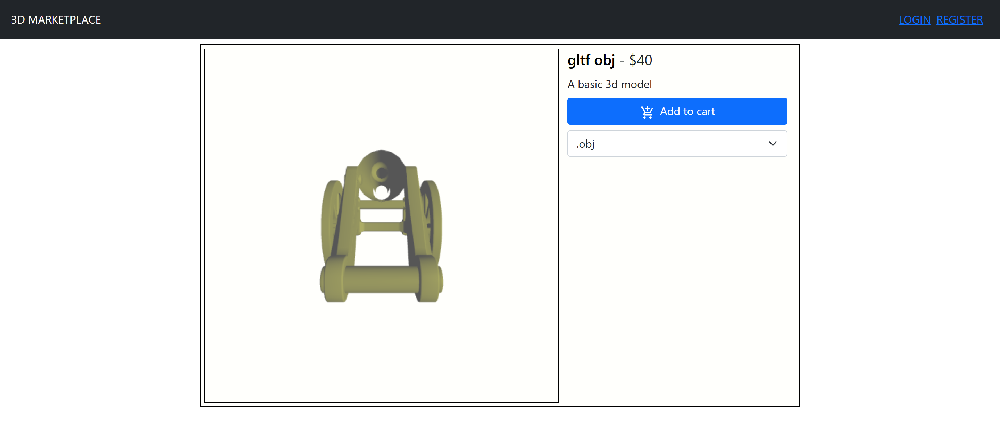

# 3D Shop

Marketplace for buying and selling 3D models. Sellers upload `.obj` or `.gltf` files with a thumbnail and a price; buyers rotate the model in the browser before buying, then download the files they own.



Laravel 8 API with Sanctum token auth over SQLite, React 17 client with Redux Toolkit, three.js through React Three Fiber and drei, Bootstrap 5 for layout.

```
3d-shop-api/       Laravel API
3d-shop-client/    React SPA
docs/              full documentation (PDF, DOCX, PPTX)
```

## Running locally

### API

```bash
cd 3d-shop-api
composer install
cp .env.example .env
```

`.env.example` selects MySQL, so set these in the new `.env`:

```ini
DB_CONNECTION=sqlite
SESSION_DOMAIN=localhost
SANCTUM_STATEFUL_DOMAINS=localhost
```

```bash
touch database/database.sqlite   # PowerShell: New-Item database/database.sqlite
php artisan key:generate
php artisan migrate
php artisan storage:link
php artisan serve
```

`storage:link` creates the `public/storage` symlink that uploaded files are served through.

### Client

```bash
cd 3d-shop-client
npm install
npm start
```

Runs on port 3000 and expects the API on port 8000, set in `src/consts.js` and `src/service/api/axiosClient.js`.

The three.js loaders fetch model files over XHR, so those files need CORS headers. `php artisan serve` returns anything under `public/`, the `public/storage` symlink included, without passing it through Laravel's middleware, so `/storage` has to send `Access-Control-Allow-Origin` for previews to load across origins.

## API

All routes are in [3d-shop-api/routes/api.php](3d-shop-api/routes/api.php). Listings paginate at 16 records and take `?page=n`. Rows marked ✓ need an `Authorization: Bearer <token>` header.

| Method | Path | Auth | Purpose |
| --- | --- | :-: | --- |
| `GET` | `/api/products` | | Paginated catalogue, ordered by id |
| `GET` | `/api/products/{id}` | | One product |
| `GET` | `/api/products/search/{name}` | | Products whose name contains the string, unpaginated |
| `GET` | `/api/products-by-user/{userId}` | | One seller's uploads |
| `POST` | `/api/auth/register` | | `name`, `email`, `password`, `password_confirmation`; returns user and token |
| `POST` | `/api/auth/login` | | `name`, `password`; returns user and token |
| `POST` | `/api/products` | ✓ | Upload, multipart: `name`, `price`, `description`, `thumbnail`, and `objModel` and/or `gltfModel` |
| `GET` | `/api/products-authenticated/{id}` | ✓ | One product plus `product_status` of `owner`, `purchased` or `not-purchased` |
| `GET` | `/api/current-user-products` | ✓ | Caller's uploads |
| `GET` | `/api/owned-products` | ✓ | Products the caller has bought |
| `POST` | `/api/sales/buy` | ✓ | Buy a `products` array of `{ id }` in one transaction |
| `GET` | `/api/sales` | ✓ | Sales made on the caller's products |
| `POST` | `/api/auth/logout` | ✓ | Revoke the caller's tokens |
| `GET` | `/api/user` | ✓ | The authenticated user |

`PUT /api/products/{id}` is also declared for editing a product. The client never calls it and it does not currently resolve to a controller class.

## Database

SQLite, relational, queried through Eloquent. Three tables matter: `users`, `products` and `sales`. A product holds a public path per geometry file, a thumbnail path and the seller's `user_id`. A sale holds `buyer_id`, `product_id` and the price paid, so repricing a product leaves past revenue intact; the seller of a sale is reached through `product_id`. The rest are the Laravel and Sanctum defaults for tokens, password resets, failed jobs and migration state.

No query is SQLite specific, so moving to MySQL or PostgreSQL is a `DB_CONNECTION` change plus a data migration.

## Client structure

```
src/
  components/common/   reusable pieces, including the model displayers
  components/pages/    one folder per screen
  routes/              RouterWrapper.jsx, every application route
  service/api/         axiosClient.js, one shared Axios instance
  service/features/    Redux slices: auth, cart, product, products, productUpload, sales
  service/util/        fileToDataUri.jsx
```

Components dispatch thunks and the slices own every call to the API. `redux-persist` keeps `auth` and `cart` in local storage, so a session and a filled cart survive a reload.

`ObjModelDisplayer.jsx` and `GltfModelDisplayer.jsx` take a `fileUrl` and an `isLocalFile` flag, set up a React Three Fiber canvas with drei's `OrbitControls`, and sit behind an error boundary. The `isLocalFile` flag is how the upload page previews a file straight from the browser before it reaches the server.

## Docs

[docs/documentation.pdf](docs/documentation.pdf) covers the technology choices, the database design, every endpoint, the Redux store slice by slice and a walkthrough of the application flow.

GPL-3.0, see [LICENSE](LICENSE).
