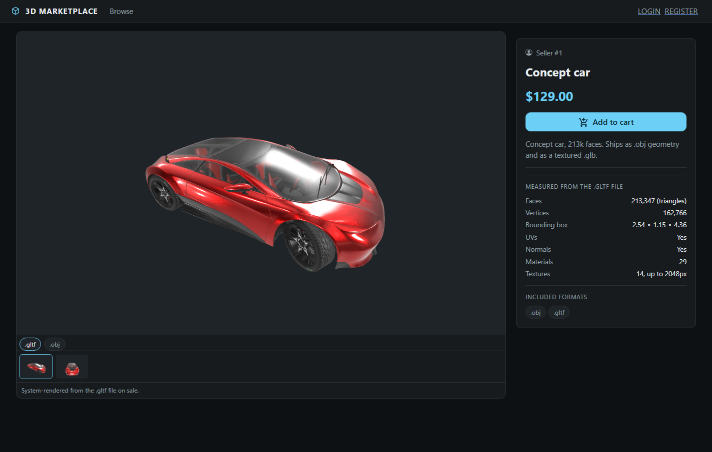
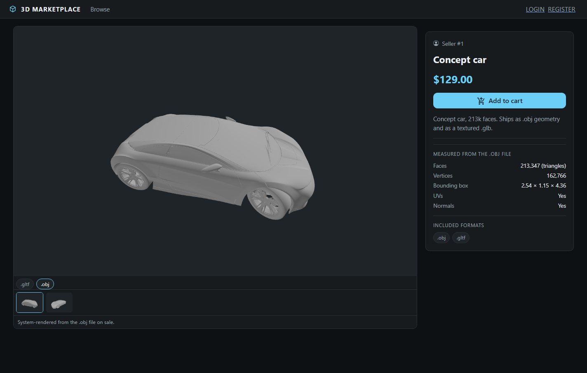

# 3D Shop

Marketplace for buying and selling 3D models. Sellers upload `.obj`, `.gltf`,
`.glb`, `.stl` or `.fbx` with a price — on their own or zipped with their
textures; buyers browse still images that this server rendered from the exact
file on sale, and download the geometry once they own it. Downloads are gated
behind short-lived signed URLs, and for the default preview mode the geometry is
never sent to a browser that has not paid for it.



## Attested previews

The usual way to show a 3D model on the web is to send the geometry to the
browser and let it render. That is convenient and it gives the file away: the
Khronos Group, who publish glTF, say plainly that client-side rendering cannot
protect geometry. The alternatives in the market are DRM or substitution.
Sketchfab shipped an obfuscated `.binz` container that was fully reverse
engineered; TurboSquid sidesteps the problem by showing rendered turntables
instead of the model.

This project takes the substitution route and closes the gap it opens. When a
seller frames a shot in the upload screen, the browser sends the *camera
parameters* rather than an image — position, target, field of view. A queued
job then re-renders that camera server-side in a container with
`--network=none`, and records with the resulting image:

- the camera it was rendered from,
- the SHA-256 of the source model at the moment of rendering,
- the SHA-256 of the image itself,
- and the renderer's identity: three.js 0.186.0, the exact Chromium build,
  SwiftShader as the rasteriser, and a digest of the render harness itself.

So a still is not a picture the seller supplied, it is a measurement this
server took of the file that is for sale. A seller can pick the flattering
angle; they cannot show a different model than the one they are selling.

The claim being made is **integrity, not protection**. Nothing here stops
someone who has bought a model from redistributing it. What it does stop is a
listing whose images do not depict what the buyer receives.

I have not found this shipped anywhere: camera-parameters-in,
server-render-out, with the render recorded against the source hash.

### Verifying it

Every still carries its record at `GET /api/previews/{id}/attestation`, which
is public and needs no token. The record also reports `still_on_sale`: if the
deliverable is ever replaced, the image and its hashes stay perfectly valid
while no longer depicting the file on sale, and a hash comparison alone would
not reveal that.

`php artisan render:verify {product} --format=obj` goes further. It re-fetches
the model from object storage, re-renders every recorded camera, and compares
the results to the stored hashes. That works because the render container is
deterministic — headless Chromium with SwiftShader, no GPU, fixed versions —
and two runs produce byte-identical PNGs. Determinism is what makes the record
checkable rather than merely readable, and it has been re-verified after a
Chromium rebuild, a refactor of the render input, and a change to the harness
digest.

### Watching it fail

A check nobody has seen fail is not a check, so both kinds of substitution can
be demonstrated. Publish something, then break it on purpose:

    php artisan files:audit --product=1
    # ...replace the stored model in object storage with any other file...
    php artisan files:audit --product=1

The second run names the file and both hashes and exits non-zero.
`render:verify` refuses the same product before it renders a single pixel.

Two substitutions, caught in two different places, because they are different
attacks:

- **The bytes change under an untouched row.** The checksum column cannot
  notice this by itself; only reading the file back can. That is `files:audit`,
  which needs nothing but the database and storage, so it runs anywhere.
- **The deliverable is replaced properly**, row and all. Then the images and
  their hashes stay perfectly valid while no longer depicting what is on sale,
  and the attestation endpoint reports `still_on_sale: false`.

Note what deliberately does *not* change in the second case: the record still
says what was true when the image was produced. It is a record, not a live
assertion, and comparing it to the present is the auditor's job.

The honest limit: the server is restating its own record, so verification
proves internal consistency, not honesty. A third party who does not trust this
server cannot be satisfied by it.

The usual answer is to sign the images — C2PA or similar — and this project
deliberately does not. Signing buys a trust root and a key-management burden,
and the check it enables is one nobody performs: buyers of a $20 asset do not
verify cryptographic provenance, and there is no tooling in a 3D artist's
workflow that would prompt them to. It would be reassurance aimed at reviewers
rather than at anyone using the site.

So the limit is accepted rather than solved. What is offered instead is cheaper
and actually gets used: determinism, a public record per image, a re-run anyone
can perform with `render:verify`, and `files:audit` to prove the stored bytes
are still the ones that were recorded.

## Preview modes

A seller picks one at publish time, per product.

| Mode | Buyer sees | Geometry |
| --- | --- | --- |
| `attested_stills` (default) | Server-rendered stills with the badge above | Never sent before purchase; the preview route 403s |
| `interactive` | Orbit-controls viewer with the real model | Sent to the browser by design |

`interactive` is not a weaker version of the same guarantee, it is the
trade-off taken deliberately: a buyer who can spin the model learns much more
about it, and anyone who can spin it can save it.

## Per-format previews

A model uploaded as both `.obj` and `.gltf` is two different files, and they do
not have to look alike — an `.obj` carries no materials of its own, and a glTF
carries PBR maps. So previews are rendered and stored per format, one queue job
per (product, format), and the product page gives the buyer a pill per format
with a badge naming the file each still came from. The product's overall status
is a pessimistic aggregate: it reads `rendering` while any format is still
going, and `failed` if any format failed.

The same car as an `.obj`, one pill away. Nothing was substituted: both stills
are this server's own renders of the two files that ship with the product, and
the badge names which file each came from.



A seller may also attach their own images, which appear behind their own "From
the seller" tab and are stored separately from anything the server produced.
Only the server's own images carry a badge: labelling a seller's photograph
reads as a disclaimer against them, and the tab already says whose it is.

## Formats, and models that arrive with their textures

`ModelFormats` is the one list a format is added to; the validation rules, route
patterns and upload fields all derive from it. `.obj`, `.gltf`/`.glb` and `.stl`
are parsed directly. `.fbx` is converted to `.glb` by assimp in the same
sandboxed container the renderer uses; the converted file is kept as its own
artifact and the record carries the whole chain — the uploaded file's checksum,
the tool, the converted file's checksum, then the image's. A conversion is never
presented as though it had not happened.

A model with separate texture files can be uploaded as a zip. The archive is
what the buyer downloads, byte for byte; the server opens a copy to find the
model inside, measures that, and renders it with its textures in place. Every
file in the archive is recorded by path, size and checksum, and the images are
attested against a digest of the whole set rather than of one file — a texture
swapped inside the zip changes the digest.

Archives are inspected before anything is written: the index is read and the
upload refused for traversal, absolute or drive-letter paths, reserved Windows
names, symlink entries, names that would collide once the filesystem is done
with them, encrypted entries, and compression ratios that indicate a bomb. Files
are then written one at a time with the byte budget counted as bytes arrive,
because a central directory can declare ten bytes and produce four thousand. An
archive inside an archive is carried through to the buyer and never opened.

Where two formats of one product have both been measured, the listing says
whether they agree on face count and bounding box, so a clean `.glb` shipped
beside a stale `.obj` is visible to the buyer rather than a surprise after
purchase. Vertex counts are deliberately not compared: `.stl` repeats a shared
corner per triangle, so an honest pair disagrees by construction.

## Replacing a file, and the record it leaves

Exports break — the wrong scale, a missing texture path, an unapplied modifier
stack. Freezing files forever means the only remedy is a new listing, which
throws away its URL and its sales history, so a file can be replaced instead.

Replacing one is an explicit operation, not an edit:

- The previews **re-render immediately**, against the same cameras. There is
  never a moment when the pictures describe the previous file. The product is
  locked while that happens — edits and further replacements are refused until
  it finishes.
- The old file and its previews are **kept, marked superseded**. Every preview
  claimed to come from a particular model; discarding that model would leave
  the claim unverifiable. Their attestation records keep resolving and gain the
  date they stopped being on sale.
- The listing carries it permanently: *".gltf file replaced once — until 10
  September 2026"*, the seller's own note, and the superseded views themselves,
  each still linking to what it was rendered from. Buyers see this, not just
  the owner.
- The seller may attach a short note saying what changed. It is their account
  of events, not a verified one.

Camera angles and the preview mode are still settled at publish. Only the file
can change, and only loudly.

Substituting a genuinely different model is still possible; nothing can tell a
fix from a swap by looking at two files. What the trail removes is the reason
to try, since the reputation a swap would inherit no longer looks intact.

A seller can withdraw a listing (`DELETE /api/products/{id}`), which sets
`unlisted` rather than deleting anything: it leaves the catalogue, search and
the seller's public page, and can no longer be bought, while anyone who
already paid keeps the product and its downloads. Withdrawing is one way —
there is no re-list endpoint, so the client asks for confirmation first.

## The download gate

Deliverables live on a private disk and are served through short-lived signed
URLs, issued only to the owner or a buyer. Describing these accurately: they
are **capabilities**, not identities. Anyone holding the link can use it until
it expires. That is the standard trade-off for letting a CDN or object store
serve bytes without asking the application about every range request.

## Payment

`PaymentGateway` has three implementations: Stripe, PayPal, and a fake bound
automatically when no credentials are configured, so the project runs end to end
for someone who has not signed up to a provider. The fake speaks Stripe's real
webhook wire format with a local secret, so signature verification runs in tests
rather than being stubbed past.

Access follows the provider's notification, not the buyer's browser. A buyer who
closes the tab after paying still gets what they bought, and returning to the
site early grants nothing. Notifications are verified with the provider before
being acted on, and `insertOrIgnore` on the event id makes a replayed one a
no-op rather than a second grant or a second charge. `payments:reconcile` asks
the provider about orders whose notification never arrived.

Refunds run the same path backwards: the provider says refunded, the `Sale` rows
go, and the signed download URLs stop being issued. Nothing depends on an
operator remembering to revoke anything.

Money is integer cents with a currency, and every order item keeps its own copy
of the price, so repricing a product does not rewrite what someone paid. Orders
below the provider's minimum charge are refused with a message naming both
figures instead of failing at the provider.

## Uploads and credentials

Two places where the obvious implementation is the wrong one.

**The stored filename is derived, never taken from the upload.** A real PNG
called `payload.png.aspx` passes `image` validation, because that rule reads
the bytes and not the name — and would then sit on the public disk under a
name a web server may hand to an interpreter. Deliverables are named from the
format their magic bytes report and images from their MIME type, so the
uploader has no say in it. Laravel blocks the php family outright, which is
where this problem is usually noticed and where it usually stops.

The same magic-byte check runs at upload rather than only in the render job:
a file that is not a model, or whose bytes disagree with its extension, is
refused before a product row or any stored bytes exist. So are models over the
face and byte limits.

**A failed sign-in says the same thing either way.** "Username not found"
against "Incorrect password" tells an attacker which half of a guess to keep,
and so does answering faster when the name does not exist — a bcrypt check is
190ms and refusing without one is 0.2ms. Both cases now return the same
message after the same work, and login and registration are rate limited to
10 requests a minute per address.

## Live completion notices

A render takes seconds to minutes, so the seller would otherwise have to
reload to find out. Laravel Reverb (a first-party WebSocket server, no pcntl,
so it runs on Windows) broadcasts on a private per-seller channel at both
terminal states, and Laravel Echo picks it up in the client.

The socket is the *notification*, not the truth: the product endpoint stays
authoritative, and the product page also polls while a render is pending. A
missed frame, a dropped connection or a broadcast that throws must not leave a
seller looking at a stale page, and broadcasting from the job is best-effort
for the same reason — a failure to announce a render is not a failure to
render.

## Failure behaviour

A render gets two attempts, 30 seconds apart, and only for transient failures:
a timeout, the container dying, an unexpected throw. A model that simply cannot
be rendered fails on the first attempt and is not retried, since the second
attempt would fail identically.

`preview_status` stays `rendering` between attempts, so the seller sees one
pending state rather than a flap through `failed` and back. If the worker dies
outright, `failed()` writes the terminal status. Scratch directories are kept
on failure because `result.json` is the only diagnostic there is.

The job is unique per (product, format) while queued or running, with the
uniqueness window set to outlive both attempts plus the backoff. The renderer's
output filenames are validated rather than trusted, and a run that reports
success with zero triangles is treated as a failure — Chrome has been observed
returning `error: null` and an empty image on a model too large to load, and a
loud failure beats a silent success.

## Housekeeping

| Command | Schedule | What it does |
| --- | --- | --- |
| `php artisan files:prune --days=3 --dry-run` | daily | Deletes stored files whose product rows are gone |
| `php artisan renders:reap --minutes=25 --dry-run` | hourly | Marks renders whose worker died mid-flight as failed |
| `php artisan files:audit` | on demand | Re-hashes every stored file against the checksum recorded for it |

Deleting a product cascades its `product_files` rows but cannot reach into
object storage, so `files:prune` is what stops deleted products leaving their
bytes behind forever. Both take `--dry-run` and both can be run by hand.

## How this scales

Measured on this hardware, in bottleneck order:

1. **Ingest bandwidth.** Uploads are large and the network fills first.
2. **Render-tier RAM.** Parsing costs about **2.8× the file size** in
   resident memory: a 106 MB model peaks near 350 MB, a 929 MB model near
   2.6 GB. This sets how many workers fit on a machine.
3. **Chrome's fixed overhead**, about 1 second per run regardless of the
   model. A 25,940-triangle `.obj` renders in 1.06s total.
4. **Parse throughput**, which is where texture decode shows up: ToyCar.glb
   (5.4 MB, 108,936 triangles, PBR with decals and normal maps) took 19.2s for
   two angles against roughly 2s for the untextured 25,940-triangle `.obj`.
   Texture decode dominates, not triangle count.

The render tier is **RAM-bound, not CPU-bound**, which is the number that
decides the pool size. The queue broker is never the limit.

Admission control is free: a pre-scan counts faces without parsing, at about
175× less cost than a parse (0.13s versus 4.8s on a 106 MB file), so a model
that would OOM a worker is rejected at upload instead of killing one. Files
over 5,000,000 faces or 600 MB are refused. Decimating instead of refusing was
measured and rejected — `fast_simplification` took 77s on 2.64M triangles and
plateaued at 1.95M regardless of the target.

### Across machines

The render tier holds no state. A worker takes a job, fetches the model from
object storage into local scratch, renders with `--network=none`, uploads the
images back, and writes rows to Postgres. Nothing ties a worker to a
particular host's disk, so adding render capacity is starting another worker
somewhere with Docker and the render image.

This is demonstrated rather than asserted: two separate application roots
sharing only Postgres, Redis and MinIO worked the same queue concurrently. The
second root held **zero model bytes** on disk and pulled the 1.8 MB model from
object storage to render it. Per-host requirements are Docker, the render
image, and a scratch directory.

Getting there took two changes worth naming, because both are the kind that
look fine on one machine: the models disk moved from a bind mount to object
storage, and the cache store moved from `file` to Redis — with `CACHE_STORE=file`
the job's uniqueness lock is per-host, so two machines will happily render the
same job twice. That was confirmed with a negative control before the fix.

## Stack

Laravel 13.31 on PHP 8.4 with Sanctum bearer tokens, Postgres 17, Redis for
the queue, cache and sessions, MinIO for object storage, Laravel Reverb for
WebSockets, and a Docker image with headless Chromium and three.js for
rendering. React 19 on Vite 8 with Redux Toolkit, three.js through React Three
Fiber and drei, Laravel Echo, and Bootstrap 5 for layout only — the dark theme
and every component's look are CSS modules in this repo.

```
3d-shop-api/          Laravel API
  render/             Dockerfile, harness.html, render.mjs (the render container)
3d-shop-client/       React SPA
docs/                 full documentation (PDF, DOCX, PPTX)
```

Guzzle stays on 7 rather than 8: Reverb's dependency chain constrains
`guzzlehttp/psr7`, and a portfolio project claiming "everything on latest"
should say where that is not true.

## Running it

```
git clone <this repo> && cd 3d-shop
docker compose up --build
```

Then open <http://127.0.0.1:3000>. Nothing else to install, no accounts to make:
with `PAYMENTS_ENABLED=false` the application binds a fake payment gateway, so
browsing, buying and downloading all work without a provider. Register a user in
the UI and upload a model — the catalogue starts empty, because shipping a model
in the repository would mean shipping its licence too.

Use `127.0.0.1` rather than `localhost`: on Windows the latter resolves to `::1`
first, and anything already listening there answers instead.

The published ports move if something already holds them:

```
CLIENT_PORT=3100 API_PORT=8001 MINIO_PORT=9100 REVERB_PORT=8081 docker compose up
```

**The one thing worth understanding**: the worker mounts the Docker socket, so it
can start the render container as a *sibling* rather than a child. Each render
still gets a fresh, network-less container of its own — two sellers' files never
share a process — and that isolation is why the socket is mounted into the
worker alone and nothing else. The worker learns the host paths for its own
volumes by asking the daemon about itself, so no host path is ever configured by
hand.

## Running locally without Docker

Developed on Windows, which is why Reverb is the broadcast driver (Horizon
needs pcntl and cannot run here) and why the queue worker is an ordinary
`queue:work`. Everything works on Linux and parses about **5× faster** there —
the same 106 MB file takes 4.8s in the container against 22.9s on Windows.

You need PHP 8.3+, Composer, Node, Docker, Postgres, Redis, and an S3-compatible
store. MinIO is what this was built against:

```bash
docker run -d -p 9000:9000 -p 9001:9001 \
  -e MINIO_ROOT_USER=3dshop -e MINIO_ROOT_PASSWORD=3dshop-secret \
  minio/minio server /data --console-address ":9001"
```

Create the `3dshop-models` and `3dshop-public` buckets, and make the public one
readable. Object storage is not mandatory — both disks take a driver name, so
`MODELS_DISK=local` and `PUBLIC_DISK=local` in `.env` keep files on disk
instead, at the cost of the multi-host property above.

### API

```bash
cd 3d-shop-api
composer install
cp .env.example .env
php artisan key:generate
php artisan migrate
php artisan storage:link
```

Then build the render image from the repository root, not from `3d-shop-api` —
it copies the harness from the API and `fitToView.js` from the client, so that
the server frames a model exactly as the browser did:

```bash
cd ..
docker build -t 3dshop-render -f 3d-shop-api/render/Dockerfile .
```

`.env.example` points at Postgres, Redis and MinIO on their default local
ports with the credentials above. Set `REVERB_APP_ID`, `REVERB_APP_KEY` and
`REVERB_APP_SECRET` to any values; they only have to match between the API and
the client.

### Client

```bash
cd 3d-shop-client
npm install
npm run dev
```

### Four processes

The app needs all four running. Renders are queued, so without the worker a
product publishes and its previews never appear.

```bash
php artisan serve          # API on :8000
php artisan queue:work     # render jobs
php artisan reverb:start   # WebSockets on :8080
npm run dev                # client on :3000
```

Vite serves port 3000 and proxies `/api`, `/storage`, `/sanctum` and
`/broadcasting` to the API, keeping the whole app on one origin. That matters
for the interactive viewer: three.js loaders fetch model files over XHR, and
those are served off disk without passing through Laravel's middleware, so
cross-origin requests for them would carry no `Access-Control-Allow-Origin`
header. The API's own CORS allow-list is `CORS_ALLOWED_ORIGINS`.

The catalogue starts empty: register through the UI and upload a model.

## Publishing a model


1. Drop a file. The format resolves from the file itself, and both `.obj` and
   `.gltf`/`.glb` can be attached to one product; whichever was just attached
   becomes the active tab, since it is the one with no angles yet.
2. Frame the model and press the camera button to capture an angle. Each
   capture is stored per format, and any capture can be made the thumbnail.
3. Fill in name, description and price. Publish stays disabled until the
   listing is valid.
4. Publishing queues one render job per format. A notice arrives when they
   finish.

## API

All routes are in [3d-shop-api/routes/api.php](3d-shop-api/routes/api.php).
Listings paginate at 16 records and take `?page=n`. Rows marked ✓ need an
`Authorization: Bearer <token>` header.

| Method | Path | Auth | Purpose |
| --- | --- | :-: | --- |
| `GET` | `/api/products` | | Paginated catalogue, ordered by id |
| `GET` | `/api/products/{id}` | | One product, with `previews` grouped per format |
| `GET` | `/api/products/search/{name}` | | Products whose name contains the string, unpaginated |
| `GET` | `/api/products-by-user/{userId}` | | One seller's uploads |
| `GET` | `/api/products/{id}/preview/{format}` | | Geometry for the interactive viewer; 403 for attested-stills products |
| `GET` | `/api/products/{id}/download/{format}` | | Issues a short-lived signed URL to the owner or a buyer |
| `GET` | `/api/previews/{preview}/attestation` | | The attestation record for one still |
| `POST` | `/api/auth/register` | | `name`, `email`, `password`, `password_confirmation`; returns user and token |
| `POST` | `/api/auth/login` | | `name`, `password`; returns user and token |
| `POST` | `/api/products` | ✓ | Publish, multipart: `name`, `price`, `description`, `thumbnail`, `objModel` and/or `gltfModel`, `preview_mode`, `preview_angles` keyed by format, and up to 8 seller `images` |
| `PUT` | `/api/products/{id}` | ✓ | Edit `name`, `description` or `price` on a product the caller uploaded; rejects files, angles and preview mode |
| `DELETE` | `/api/products/{id}` | ✓ | Withdraw the caller's listing; buyers keep what they bought |
| `POST` | `/api/products/{id}/replace` | ✓ | Replace one model file: re-renders its previews, keeps the old file and previews as superseded |
| `GET` | `/api/products-authenticated/{id}` | ✓ | One product plus `product_status` of `owner`, `purchased` or `not-purchased` |
| `GET` | `/api/current-user-products` | ✓ | Caller's uploads |
| `GET` | `/api/owned-products` | ✓ | Products the caller has bought |
| `GET` | `/api/sales` | ✓ | Sales made on the caller's products |
| `POST` | `/api/auth/logout` | ✓ | Revoke the caller's tokens |
| `GET` | `/api/user` | ✓ | The authenticated user |

## Database

Postgres, queried through Eloquent. `users`, `products`, `sales` and
`product_files` are the tables that matter.

Money is stored as `price_cents` with a `currency` column, on both products and
sales: integer arithmetic is exact, and a currency that was never recorded
cannot be recovered later. A sale keeps its own copy of the price so a seller
can reprice without rewriting what past sales earned. Products carry an
`unlisted` flag rather than a soft delete, because a buyer must keep access to
what they bought.

`product_files` holds every file a product owns — one row per deliverable,
preview image, thumbnail and seller image — with its disk, path, byte count,
SHA-256 and a `meta` JSON column. The camera, render status and attestation
data live in `meta`; a preview image points at the deliverable it was rendered
from through `source_file_id`. Rows cascade on product delete.

The schema is Postgres-specific in places (the `kind` check constraint, JSON
path queries such as `meta->render->status`), so moving to another engine is
more than a `DB_CONNECTION` change.

## Design decisions

The choices that shaped the project, and what they were weighed against.
[docs/documentation.pdf](docs/documentation.pdf) has the fuller reasoning for
the older ones.

| Decision | Why |
| --- | --- |
| React on the client | Few frameworks make rendering 3D geometry in the browser convenient, and React Three Fiber gives easy access to three.js. The 3D requirement picked the framework, not the other way round. |
| A relational database | A document store was the alternative, on the reasoning that a model can ship in several formats with a varying number of resources. Relational won because the commercial half of the domain is relational and it is the smoother fit with Eloquent. |
| A `product_files` table, not paths on the product | The lighter option was a column per file. A table is what lets one product own several deliverables, many previews and their attestation records without a schema change per file type. |
| Sanctum for authentication | Token auth that is light and fits Laravel closely, chosen on the basis that this project has no need for OAuth2. |
| Redux for state | To keep application state owned and updated somewhere separate from the components that render it. The upload screen is a slice too, so a draft survives a re-render and the reducers can be tested without a browser. |
| Bootstrap for layout only | Picked for the grid rather than the look of its components: the layout survives even though every component is restyled here. |
| Integer cents plus a currency column | Exact arithmetic, and currency is the only omission that cannot be recovered from the data later. |
| A sale stores its own price | Copying the price onto the sale means a seller can reprice a product later without rewriting what past sales earned. |
| Attested stills as the default preview | The buyer-facing guarantee is the point of the project; the interactive viewer stays available for sellers who would rather show the geometry. |
| Headless Chromium and three.js in the container | The client already renders with three.js, so the container renders what the seller framed. A different engine would produce a different image from the same camera, and the attestation would be describing a renderer that never made those pixels. A test asserts the container's three.js version matches the client's pin. |
| A Node driver for the render harness | The harness is three.js in a page. Driving it from Node keeps one language across the client, the harness and the driver; a Python driver was written first and produced byte-identical output, so the choice cost nothing. |
| Redis for queue, cache and sessions | The queue needs a broker the render tier can reach from any host, and the same requirement applies to the uniqueness lock — on a per-host file cache, two machines render the same job twice. |
| Reverb for WebSockets | First-party, needs no pcntl so it runs on the Windows development machine, and needs no hosted broker. Pusher would have worked identically with an account. |
| A replacement trail, not immutable files | Files were immutable at first. Exports break, and the only remedy was a new listing that discarded its own history; a trail protects the claim better than a rule nobody can live with. |
| Cameras belong to the listing, not the file | A replacement re-renders against the same cameras, so a view can be compared before and after. |
| Listing endpoints split by intent | `current-user-products` and `products-by-user` return near-identical data, kept apart so a change like letting sellers unlist a product touches one endpoint rather than branching inside a shared one. |

## Client structure

```
src/
  components/common/    reusable pieces, including the model displayers
  components/pages/     one folder per screen
  routes/               RouterWrapper.jsx, every application route
  service/api/          axiosClient.js, one shared Axios instance
  service/cookies/      consent check and its wrapper
  service/realtime/     echo.js, the Laravel Echo connection
  service/features/     Redux slices: auth, cart, product, products,
                        productUpload, uploadDraft, sales
  service/util/         fileToDataUri, formatPrice, validate
```

Components dispatch thunks and the slices own every call to the API.
`redux-persist` keeps `auth` and `cart` in local storage, so a session and a
filled cart survive a reload. The upload draft is a slice as well, which is
what lets the three-step screen keep captured angles, a thumbnail choice and
seller images consistent while React re-renders around it.

`ObjModelDisplayer.jsx` and `GltfModelDisplayer.jsx` take a `fileUrl` and an
`isLocalFile` flag, set up a React Three Fiber canvas with drei's
`OrbitControls`, and sit behind an error boundary. The `isLocalFile` flag is
how the upload screen renders a file straight from the browser before it
reaches the server, which is also how a captured camera comes from the same
renderer the buyer's stills will be made with: `CameraProbe.jsx` reads the live
camera out of the canvas when the seller presses the shutter.

## Known limits

- **Sellers are never paid out.** Commission is calculated and recorded on every
  order; distributing it needs the provider's multiparty flow, which is not
  built.
- **The renderer is named but not rebuildable.** An attestation records the
  Chromium version and the pinned three.js, but the render image builds from a
  floating `node:22-slim` with an unpinned `chromium` package, so an image built
  today and one built next year are not the same renderer.
- **Tokens are never pruned.** `personal_access_tokens` grows forever.
- **Search is unindexable** as written: a `LIKE '%term%'` scan, unpaginated.
- **Verification is self-attested**, deliberately — see above for why signing
  was rejected rather than deferred.
- **Withdrawing a listing is one way.** There is no re-list endpoint.
- **Horizon cannot run here** (pcntl), so the queue is a plain worker with no
  dashboard.

## Docs

[docs/documentation.pdf](docs/documentation.pdf) is written as a record of how
the project was built rather than a reference manual, so it carries the
alternatives that were considered and rejected at each step. It predates the
attested-preview work, which is documented here instead.

Test models used in the screenshots: CarConcept by Darmstadt Graphics Group
GmbH (CC-BY 4.0) and ToyCar by the Khronos Group (CC0 1.0).

GPL-3.0, see [LICENSE](LICENSE).
