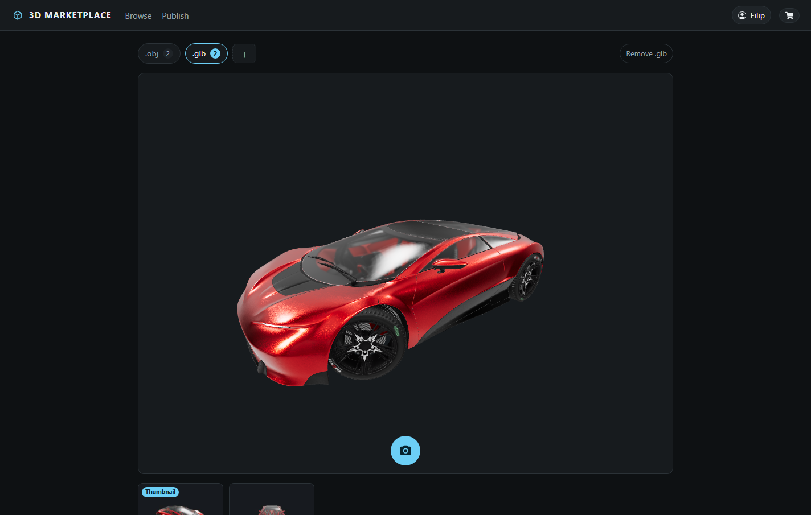

# 3D Shop

Marketplace for buying and selling 3D models. Sellers upload `.obj` or `.gltf` files with a thumbnail and a price; buyers rotate the model in the browser before buying, then download the files they own.


The viewer measures each model and frames it against the camera, so an asset authored at any scale arrives centred and filling the canvas, and orbit controls let a buyer inspect it from any angle.

Sellers get the same renderer while filling in the form. A picked file is read in the browser and previewed before anything is sent, so what the seller checks is what buyers will see.



Laravel 8 API with Sanctum token auth over SQLite, React 17 client with Redux Toolkit, three.js through React Three Fiber and drei, Bootstrap 5 for layout.

```
3d-shop-api/       Laravel API
3d-shop-client/    React SPA
docs/              full documentation (PDF, DOCX, PPTX)
```

## Running locally

### API

```bash
cd 3d-shop-api
composer install
cp .env.example .env
```

`.env.example` selects MySQL, so set these in the new `.env`:

```ini
DB_CONNECTION=sqlite
SESSION_DOMAIN=localhost
SANCTUM_STATEFUL_DOMAINS=localhost
```

```bash
touch database/database.sqlite   # PowerShell: New-Item database/database.sqlite
php artisan key:generate
php artisan migrate
php artisan storage:link
php artisan serve
```

`storage:link` creates the `public/storage` symlink that uploaded files are served through.

### Client

```bash
cd 3d-shop-client
npm install
npm start
```

Runs on port 3000 and proxies `/api`, `/storage` and `/sanctum` through to the API on port 8000, set by `"proxy"` in `package.json`. That keeps the whole app on one origin, which the 3D previews depend on: the three.js loaders fetch model files over XHR, and those files are served straight off disk by `php artisan serve` without passing through Laravel's middleware, so cross-origin requests for them would carry no `Access-Control-Allow-Origin` header.

The catalogue starts empty. Uploaded models and the SQLite file are both gitignored, so a fresh clone has no accounts and no products; register through the UI and upload a model to populate it.

## API

All routes are in [3d-shop-api/routes/api.php](3d-shop-api/routes/api.php). Listings paginate at 16 records and take `?page=n`. Rows marked ✓ need an `Authorization: Bearer <token>` header.

| Method | Path | Auth | Purpose |
| --- | --- | :-: | --- |
| `GET` | `/api/products` | | Paginated catalogue, ordered by id |
| `GET` | `/api/products/{id}` | | One product |
| `GET` | `/api/products/search/{name}` | | Products whose name contains the string, unpaginated |
| `GET` | `/api/products-by-user/{userId}` | | One seller's uploads |
| `POST` | `/api/auth/register` | | `name`, `email`, `password`, `password_confirmation`; returns user and token |
| `POST` | `/api/auth/login` | | `name`, `password`; returns user and token |
| `POST` | `/api/products` | ✓ | Upload, multipart: `name`, `price`, `description`, `thumbnail`, and `objModel` and/or `gltfModel` |
| `GET` | `/api/products-authenticated/{id}` | ✓ | One product plus `product_status` of `owner`, `purchased` or `not-purchased` |
| `GET` | `/api/current-user-products` | ✓ | Caller's uploads |
| `GET` | `/api/owned-products` | ✓ | Products the caller has bought |
| `POST` | `/api/sales/buy` | ✓ | Buy a `products` array of `{ id }` in one transaction |
| `GET` | `/api/sales` | ✓ | Sales made on the caller's products |
| `POST` | `/api/auth/logout` | ✓ | Revoke the caller's tokens |
| `GET` | `/api/user` | ✓ | The authenticated user |

`PUT /api/products/{id}` is also declared for editing a product. The client never calls it and it does not currently resolve to a controller class.

## Database

SQLite, relational, queried through Eloquent. Three tables matter: `users`, `products` and `sales`. A product holds a public path per geometry file, a thumbnail path and the seller's `user_id`. A sale holds `buyer_id`, `product_id` and the price paid; the seller of a sale is reached through `product_id`. The rest are the Laravel and Sanctum defaults for tokens, password resets, failed jobs and migration state.

No query is SQLite specific, so moving to MySQL or PostgreSQL is a `DB_CONNECTION` change plus a data migration.

## Design decisions

The choices that shaped the project, and what they were weighed against. [docs/documentation.pdf](docs/documentation.pdf) has the full reasoning for each.

| Decision | Why |
| --- | --- |
| React on the client | Few frameworks make rendering 3D geometry in the browser convenient, and React Three Fiber gives easy access to three.js. The 3D requirement picked the framework, not the other way round. |
| A relational database | A document store was the alternative, on the reasoning that a model can ship in several formats with a varying number of resources. Relational won because the commercial half of the domain is relational and it is the smoother fit with Eloquent. |
| Store file paths in the database | The lighter option was a naming convention such as `{id}.obj` and no stored paths. Paths were chosen against the question the convention cannot answer: what happens when one product needs several files of the same type. |
| Sanctum for authentication | Token auth that is light and fits Laravel closely, chosen on the basis that this project has no need for OAuth2. |
| Redux for state | To keep application state owned and updated somewhere separate from the components that render it. |
| Bootstrap for layout | Picked for the grid system rather than the look of its components: the responsive layout survives even if every component is restyled from scratch. |
| A sale stores its own price | Copying the price onto the sale means a seller can reprice a product later without rewriting what past sales earned. |
| Listing endpoints split by intent | `current-user-products` and `products-by-user` return near-identical data, kept apart so a change like letting sellers unlist a product touches one endpoint rather than branching inside a shared one. |

## Client structure

```
src/
  components/common/   reusable pieces, including the model displayers
  components/pages/    one folder per screen
  routes/              RouterWrapper.jsx, every application route
  service/api/         axiosClient.js, one shared Axios instance
  service/features/    Redux slices: auth, cart, product, products, productUpload, sales
  service/util/        fileToDataUri.jsx
```

Components dispatch thunks and the slices own every call to the API. `redux-persist` keeps `auth` and `cart` in local storage, so a session and a filled cart survive a reload.

`ObjModelDisplayer.jsx` and `GltfModelDisplayer.jsx` take a `fileUrl` and an `isLocalFile` flag, set up a React Three Fiber canvas with drei's `OrbitControls`, and sit behind an error boundary. The `isLocalFile` flag is how the upload page previews a file straight from the browser before it reaches the server.

## Docs

[docs/documentation.pdf](docs/documentation.pdf) is written as a record of how the project was built rather than a reference manual, so it carries the alternatives that were considered and rejected at each step. Beyond the decisions above it covers every endpoint in detail, the Redux store slice by slice, each common component, a walkthrough of the whole application flow, and the sources it was built from.

GPL-3.0, see [LICENSE](LICENSE).
